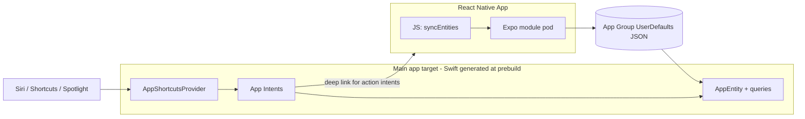

# react-native-siri

Expose your React Native app's data to **Siri, Shortcuts and Spotlight** with a declarative Expo config plugin — no Swift required.

Ask Siri things like:

> "Are there packages from Amazon in Parcels?"
> "Where is my AirPods Pro in Parcels?"
> "Track my MacBook in Parcels."

…and get spoken answers **even while your app is closed**.

- **iOS 16+** (Apple App Intents framework). Android and web install safely as no-ops.
- Works with **Expo prebuild / CNG** (SDK 52+ recommended; developed against SDK 57).

## How it works

Siri queries are answered by Apple's [App Intents](https://developer.apple.com/documentation/appintents) framework — pure Swift structs that **must be compiled into your main app target** (Apple does not allow App Shortcut-backing intents to live in a framework or pod). Your React Native app is usually not even running when Siri fires.

This library bridges that gap:

1. **JS side** — `syncEntities('packages', items)` writes your data as JSON into an **App Group `UserDefaults` suite** and tells Siri to refresh its phrase parameters.
2. **Config plugin** — at `expo prebuild` time, generates Swift (`AppEntity`, `EntityQuery`, `AppIntent`s, `AppShortcutsProvider`) from your `app.json`, copies it into `ios/<AppName>/SiriIntents/`, registers it in the Xcode project's Sources build phase, and adds the App Group + Siri entitlements.
3. **Siri time** — the generated Swift reads the App Group store natively and answers, with no JS involved. "Action" intents open your app through a deep link that you handle in JS.



## Installation

```sh
npx expo install react-native-siri
```

Then configure the plugin in `app.json` (see below) and regenerate the native project:

```sh
npx expo prebuild --platform ios --clean
```

> **Requires a development build** — this does not work in Expo Go.

### One-time Apple setup

1. In your [Apple Developer account](https://developer.apple.com/account/resources/identifiers/list/applicationGroup), register an **App Group** (e.g. `group.com.yourcompany.yourapp`) and enable the **App Groups** and **Siri** capabilities for your app identifier.
2. Use that identifier as the plugin's `appGroup` option. If you sign with automatic signing in Xcode/EAS, the capabilities are picked up from the entitlements the plugin generates.

## Quick start

The running example below is a package-delivery tracker called **Parcels**, but the same setup works for any data your app holds — orders, tasks, bookings, workouts, contacts, and so on.

```jsonc
// app.json
{
  "expo": {
    "name": "Parcels",
    "scheme": "parcels",
    "plugins": [
      [
        "react-native-siri",
        {
          "appGroup": "group.com.example.parcels",
          "entity": {
            "name": "Package",
            "collection": "packages",
            "fields": ["name", "carrier", "status", "eta"]
          },
          "intents": [
            {
              "type": "query",
              "name": "FindPackages",
              "matchField": "carrier",
              "dialog": "Packages from ${value}: ${results}.",
              "phrases": ["Are there packages from ${param} in ${appName}"]
            },
            {
              "type": "get",
              "name": "PackageStatus",
              "dialog": "Your ${name} is ${status} and should arrive ${eta}.",
              "phrases": ["Where is my ${param} in ${appName}"]
            },
            {
              "type": "action",
              "name": "TrackPackage",
              "deepLink": "parcels://track?id=${id}",
              "phrases": ["Track my ${param} in ${appName}"]
            }
          ]
        }
      ]
    ]
  }
}
```

```tsx
import { syncEntities, addIntentListener } from 'react-native-siri';

// Whenever your data changes, mirror it into the shared store:
useEffect(() => {
  syncEntities('packages', packages); // [{ id, name, carrier, status, eta }, ...]
}, [packages]);

// Handle "action" intents (they open the app via your deep link):
useEffect(() => {
  const sub = addIntentListener((event) => {
    if (event.host === 'track' && event.params.id) {
      openTrackingScreen(event.params.id);
    }
  });
  return () => sub.remove();
}, []);
```

That's it. After a rebuild, your shortcuts appear in the Shortcuts app and respond to the configured Siri phrases.

## Plugin configuration reference

```ts
type SiriPluginOptions = {
  appGroup: string;              // "group.com.example.app" — must be registered with Apple
  entity: {
    name: string;                // PascalCase, e.g. "Package" — used for Swift type names
    collection?: string;         // collection key used by syncEntities(); default: name lowercased + "s"
    fields: string[];            // string fields on every record (id is implicit)
    titleField?: string;         // spoken/visible title; default "name" (or first field)
    subtitleField?: string;      // optional subtitle in Siri/Shortcuts UI
    typeDisplayName?: string;    // human name in Shortcuts; default = name
  };
  intents: IntentConfig[];       // see below
  customSwiftFiles?: string[];   // escape hatch, e.g. ["./siri/*.swift"]
  siriUsageDescription?: string; // NSSiriUsageDescription
  userActivityTypes?: string[];  // NSUserActivityTypes; default ["<bundleId>.viewing"]
};
```

Every intent has: `name` (PascalCase, unique), optional `title` / `description`, and `phrases`.

**Phrase rules** (Apple's, enforced by the plugin):

- every phrase must contain `${appName}` (Siri requires the app name),
- at most one `${param}` per phrase,
- keep them short; users must say them fairly exactly.

### `type: "query"` — filter by a field

> "Are there packages from Amazon?"

| Option | Meaning |
| --- | --- |
| `matchField` | Entity field to filter on (e.g. `carrier`). |
| `dialog` | Spoken answer. Tokens: `${value}` (matched value), `${results}` (comma-separated titles), `${count}`. |
| `emptyDialog` | Spoken when nothing matches. Tokens: `${value}`. |

Because Siri phrases can only interpolate App Entities (not free-form strings), the plugin generates a lightweight *value entity* over the **distinct values** of `matchField` — so after `syncEntities`, Siri literally knows "Amazon" and "FedEx" as valid words for `${param}`. The intent also **returns the matched entities** so it composes in Shortcuts.

### `type: "get"` — fetch one entity, speak its details

> "Where is my AirPods Pro?"

| Option | Meaning |
| --- | --- |
| `dialog` | Spoken answer. Tokens: `${id}` and any entity field, e.g. `Your ${name} is ${status} and should arrive ${eta}`. |

Siri resolves `${param}` against your synced entities by name/id (`EntityStringQuery`). The intent **returns the entity** (with all fields exposed as properties) so its output can be piped into other Shortcuts actions.

### `type: "action"` — open the app and do something

> "Track my MacBook."

| Option | Meaning |
| --- | --- |
| `deepLink` | URL template that opens your app, e.g. `parcels://track?id=${id}`. Tokens are URL-encoded. Make sure the scheme matches `expo.scheme`. |
| `dialog` | Optional spoken confirmation. Tokens: `${id}`, any field. |

The generated intent sets `openAppWhenRun = true`, runs inside your app's process, opens the deep link, and your JS receives it via `addIntentListener`.

### `customSwiftFiles` — escape hatch

Need an intent pattern the plugin doesn't generate? Drop `.swift` files in your project (e.g. `./siri/MyIntent.swift`) and list them:

```json
{ "customSwiftFiles": ["./siri/*.swift"] }
```

They're copied verbatim into `ios/<AppName>/SiriIntents/` and compiled into the app target. They can use the generated helpers (`ReactNativeSiriStore.collection("packages")`, `ReactNativeSiriURL.open(...)`) and your generated entity types. Note: the generated `AppShortcutsProvider` only registers declared intents — custom intents appear in the Shortcuts app but need phrases added via your own provider file only if you also disable the generated one (one provider per app), so prefer wiring custom intents as Shortcuts actions rather than voice phrases.

## JS API

```ts
import * as Siri from 'react-native-siri';
```

| Function | Description |
| --- | --- |
| `syncEntities(collection, items)` | Writes records (`{ id, ...fields }`) to the App Group store and refreshes App Shortcut parameters. Values are stringified. Call whenever data changes. |
| `addIntentListener(listener)` | Fires when the app is opened by an `action` intent (or any deep link). The event has `url`, `scheme`, `host`, `path`, `params`. Returns `{ remove() }`. |
| `donateUserActivity(options)` | Donates an `NSUserActivity` for the screen the user is viewing (title, `userInfo`, `keywords`, `persistentIdentifier`, search/prediction eligibility). |
| `clearUserActivity()` | Resigns the current donated activity. |
| `getSharedData(key)` / `setSharedData(key, value)` | Raw string storage in the App Group, readable from both JS and (custom) Swift. |
| `updateShortcuts()` | Manually re-registers App Shortcut phrase parameters (rarely needed — `syncEntities` does it). |
| `getAppGroup()` | Returns the configured App Group id, or `null` if the plugin isn't set up. |

On Android and web every function is a safe no-op.

## What you can build with it

Five patterns, illustrated with the Parcels example:

### 1. Query by field — "Are there any packages from Amazon?"

A `query` intent filters synced records by a field and speaks
"Packages from Amazon: AirPods Pro, MacBook Air." It also returns the matching entities for Shortcuts.

### 2. Get details — "Where is my AirPods Pro?"

A `get` intent resolves "AirPods Pro" against your synced records and speaks
"Your AirPods Pro is out for delivery and should arrive today by 6 PM."

### 3. Act on an entity — "Track my MacBook"

An `action` intent opens the app with `parcels://track?id=pkg_42`;
the JS listener navigates to that package's tracking screen.

### 4. On-screen context — "Track *this* package"

When a record's detail view is shown, call `donateUserActivity(...)` with its id.
This makes the current item available to Siri/Shortcuts suggestions, Spotlight and Handoff,
and it powers the "Suggested" shortcuts on the lock screen.

> Full natural-language *on-screen entity resolution* ("this package") is an **Apple Intelligence
> feature (iOS 18+)** built on the same donation APIs; on iOS 16/17 donations surface as
> suggestions rather than resolving the pronoun.

### 5. Cross-app automation — "When my MacBook is delivered, text Ben"

Siri itself cannot register standing rules, but the **Shortcuts app** can, because `get` and
`query` intents return structured values. Walkthrough:

1. Open **Shortcuts** → **Automation** tab → **+** → **Create Personal Automation**.
2. Pick a trigger — e.g. **Time of Day** (every 10 minutes via repeated automations) or a
   location/charger trigger; iOS 17+ lets automations run **immediately and unattended**.
3. Add action → search your app → **Package Status** (the `get` intent). Set the package to
   **MacBook Air**. It outputs the Package entity and its spoken text.
4. Add **If** action: input = the Package's **Status** property → **is** → `Delivered`.
5. Inside **If**: add **Send Message** with recipient **Ben** and a message like
   `The MacBook has been delivered 🎉` (you can insert the entity's fields as variables).
6. Turn off "Ask Before Running". Done — a no-code, cross-app rule powered by your app's data.

The same composition works for one-shot commands: "Hey Siri, Package Status" → pipe the result into
any other app's Shortcuts action.

## Example app

[`example/`](./example) is a full working demo (mock data, sync-on-change, deep-link handling,
activity donation) wiring up all five patterns — see its `app.json` for the exact plugin config
and Siri phrases it registers.

```sh
cd example
npm install
npx expo prebuild --platform ios --clean
npx expo run:ios --device        # voice Siri needs a real device
```

Testing tips:

- **Simulator:** the **Shortcuts app** works — open it, find your app's shortcuts, run them,
  and type parameters. Spotlight search of donated activities works too.
- **Physical device:** required for **voice** Siri. Launch the app once (so `syncEntities` runs),
  then try one of your configured phrases.
- After changing synced data, phrases with parameters update within moments via
  `updateAppShortcutParameters()`.

## Architecture notes & gotchas

- **Why the Swift lives in your app target, not the pod:** Apple requires App Shortcut intents and
  the `AppShortcutsProvider` to be compiled directly into the main app target. That's exactly what
  the plugin's `withDangerousMod` + `withXcodeProject` steps do. Consequently the pod calls the
  generated `updateAppShortcutParameters()` through `NSClassFromString("ReactNativeSiriShortcutsHelper")` —
  it cannot import app-target types.
- **Unique query type names (Xcode 16+):** the App Intents metadata extractor requires every
  `EntityQuery` type name to be globally unique in the target. The generator emits top-level,
  entity-prefixed names (`PackageEntityQuery`, `PackageCarrierValueEntityQuery`) for this reason —
  follow the same convention in custom Swift.
- **Data is read-only for Siri:** intents read a JSON snapshot from the App Group. If you need
  live data at intent time, use `customSwiftFiles` and fetch natively.
- **Regenerate after config changes:** any change to plugin options requires
  `npx expo prebuild --platform ios --clean` (the `SiriIntents` folder is regenerated; don't edit it).
- **Entitlements:** the plugin adds `com.apple.security.application-groups` and
  `com.apple.developer.siri`, plus `NSSiriUsageDescription`, `NSUserActivityTypes` and the
  `ReactNativeSiriAppGroup` Info.plist key.

## Development

```sh
npm install
npm run build          # compile src/ (add `plugin` arg for the plugin)
cd example && npm install && npx expo prebuild -p ios --clean
```

## License

MIT
